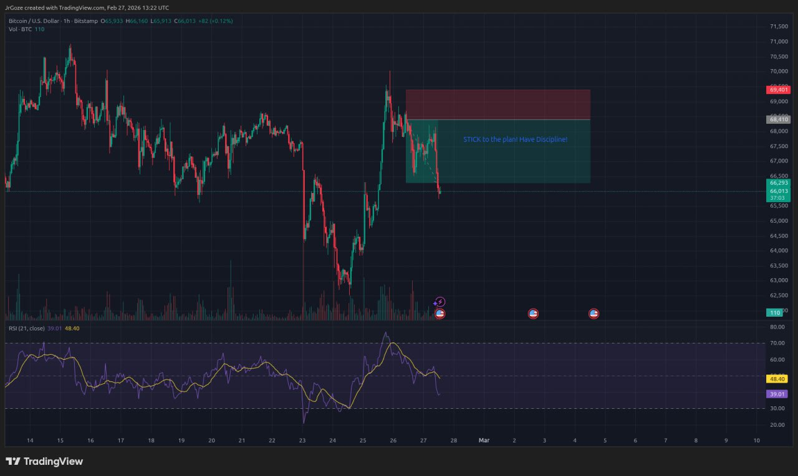

# 📈 Trading Journal

## Trade Entry: 02-27-2026

| # | Field | Value |
|---|-------|-------|
| 1 | Date | 02-27-2026 |
| 2 | Direction | SHORT 🔴 |
| 3 | Current BTC Price | N/A (Closed) |
| 4 | Entry | 68,410 |
| 5 | Stop Loss | >= 69,400.7 |
| 6 | Take Profit | <= 66,293.2 |
| 7 | Risk | 1% |
| 8 | Ratio | 2.14:1 |
| 9 | PnL | +$3,401.82 |
| 10 | PnL % | +100% |
| 11 | Status | ✅ SUCCESS |

---

## Trader's Notes

| Question | Answer |
|----------|--------|
| RSI Entry Level | 62.82 |
| RSI Rule | 70+ for SHORT, 30- for LONG |
| Action | Pressed SELL (SHORT) |
| Did you follow your rule? | No - entered at 62.82 |
| Current Status | ✅ CLOSED - SUCCESS |

---

## Professional Analysis

### What Went Well:
- ✅ Trade hit 100% take profit target
- ✅ Profited $3,401.82
- ✅ Good risk/reward ratio

### Areas to Improve:
- ⚠️ RSI entry at 62.82 (rule is 70+)

### Lessons Learned:
1. Even early entries can win
2. Good risk management works

### Recommendations:
- Wait for RSI ≥ 70 before SHORT
- Wait for RSI ≤ 30 before LONG

---

