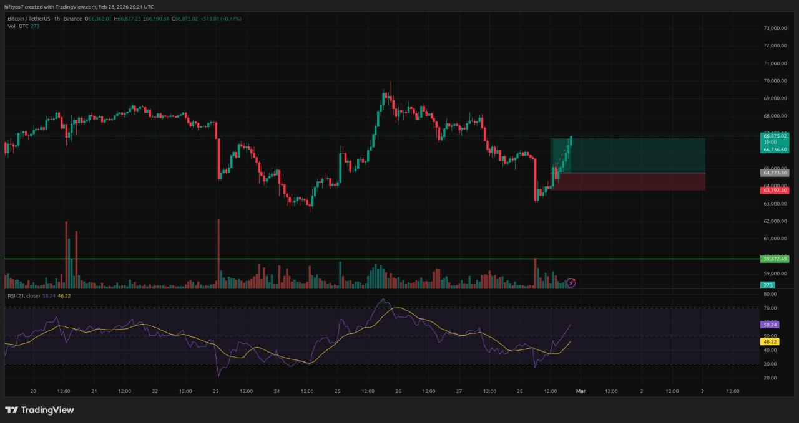

# 📈 Trading Journal - Trade #2 CLOSED ✅ WINNER

## Trade Entry: 02-28-2026

| # | Field | Value |
|---|-------|-------|
| 1 | Date | 02-28-2026 |
| 2 | Direction | LONG 🟢 |
| 3 | Current BTC Price | Closed |
| 4 | Entry | 64,773.8 |
| 5 | Stop Loss | 63,792.3 |
| 6 | Take Profit | 66,736.6 |
| 7 | Risk | 1% |
| 8 | Ratio | 2:1 |
| 9 | **PnL** | **+$3,685.45** ✅ |
| 10 | **PnL %** | **+100%** |
| 11 | Status | ✅ SUCCESS |

---

## Trade Details

| Field | Value | Source |
|-------|-------|--------|
| Entry | 64,773.8 | Positions(1) Avg Entry Price |
| Stop Loss | 63,792.3 | Last <= |
| Take Profit | 66,736.6 | Last >= |
| PnL | +$3,685.45 | Realized - hit TP |
| PnL % | +100% | Target reached |

---

## Trader's Voice Notes

> "I should have waited for RSI to become 30, when I pressed buy. Patience is more important. I should have waited before entering into the trade."

---

## 🎯 Professional Trade Assessment

### Entry Quality Score: 6/10
- ⚠️ RSI at 44 (should be ≤30 for LONG)
- ✅ Correct direction (LONG)
- ✅ Good R:R ratio (2:1)

### Risk Management: 9/10
- ✅ 1% risk
- ✅ 2:1 reward ratio
- ✅ Stop loss respected

### Patience & Discipline: 5/10
- ⚠️ Didn't wait for RSI 30
- ⚠️ Entered early

---

## 📚 Lessons Learned & Expert Advice

### What Went WELL:
- ✅ Trade hit 100% take profit target
- ✅ Profited $3,685.45
- ✅ Good risk management
- ✅ Followed through with SET and FORGET

### What to Improve:
- ⚠️ Wait for RSI ≤30 before LONG entries
- ⚠️ More patience before entering

### For NEXT Trade:
- Wait for RSI ≤30 (LONG) or ≥70 (SHORT)
- Take 5 breaths before entering
- Verify ALL rules before pressing button

---

## 📊 Winners Trade Notes

> "This trade worked out well! Hit the full TP target for +$3,685.45. 
> Even though I entered early (RSI 44 instead of waiting for 30), 
> the trade followed through and hit +100%.
> 
> Key takeaway: SET and FORGET works. Stick to the plan."

---

## 🎯 Trade #2 Summary

| Metric | Result |
|--------|--------|
| Entry | 64,773.8 |
| Exit (TP) | 66,736.6 |
| Profit | **+$3,685.45** |
| Return | **+100%** |
| Status | ✅ **WINNER** |

---

## Next Trade Reminders

| Rule | Requirement |
|------|-------------|
| 1 | RSI ≤30 (LONG) / ≥70 (SHORT) |
| 2 | Follow the trend |
| 3 | Ratio 2:1 to 3:1 |
| 4 | Stick to the plan |
| 5 | SET and FORGET |
| 6 | NO revenge trading |

---

*Trade #2: Winner! 🎉 Great job following through!*

